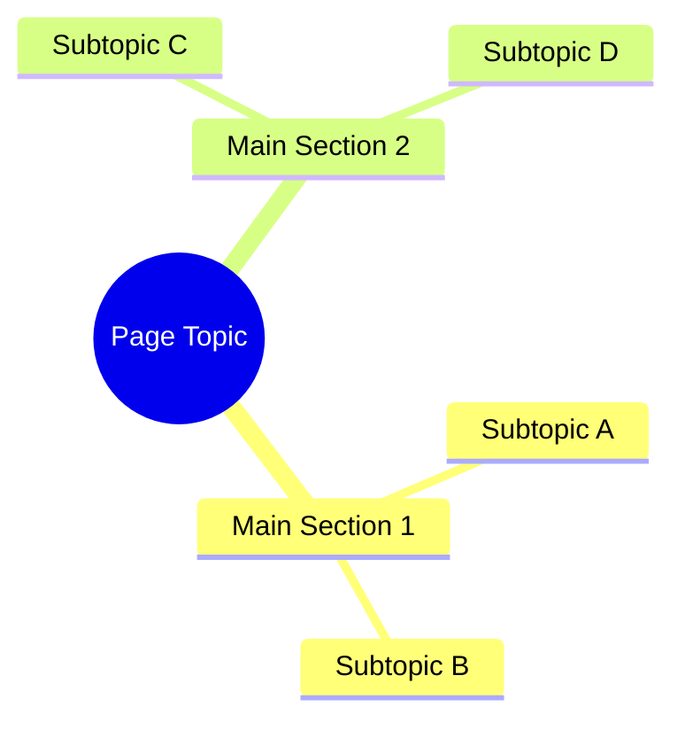
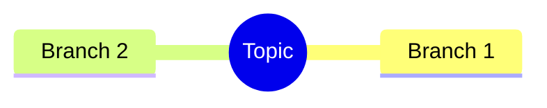
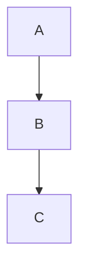
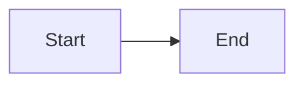
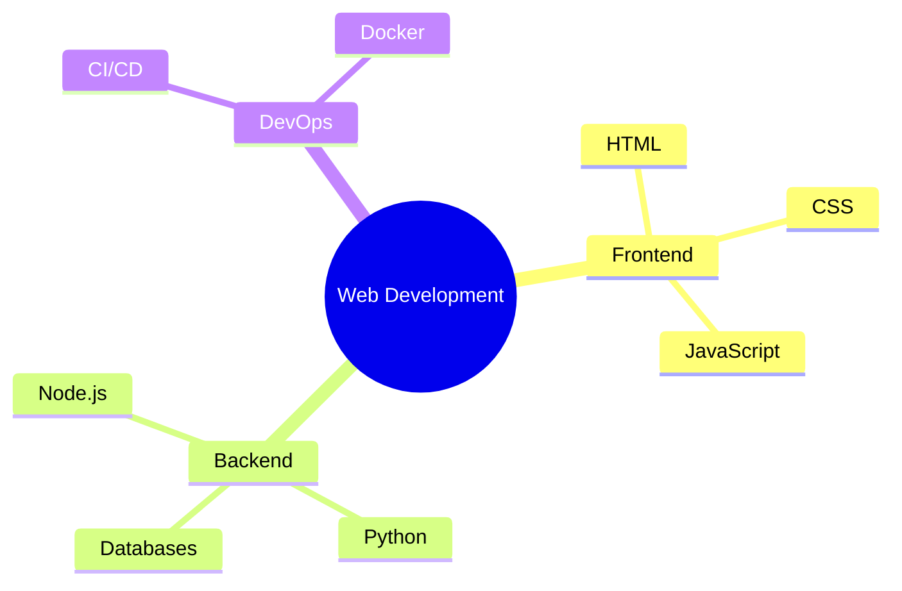

# 🧠 Mindmap Feature - Complete!

## ✅ All Enhancements Implemented

### 1. **Font Size: 14px** 🔤
- Increased from 12px to 14px
- Applied throughout the extension
- Better readability
- More comfortable for extended use

### 2. **Table Column Limit** 📊
- Added constraint to system prompt
- AI now knows: "Maximum 2 columns per table"
- Prevents broken wide tables
- Automatic enforcement

### 3. **Bubble Width Fixed** 📏
- `max-width: 100%` on message bubbles
- `overflow-x: auto` for long content
- Never exceeds sidebar width
- Proper horizontal scrolling if needed

### 4. **Auto-Scroll Enhanced** ⬇️
- Scrolls to bottom on every message
- 200ms delay for Mermaid rendering
- Smooth scrolling
- Works with dynamic content

### 5. **Mermaid.js Integration** 🎨
- Downloaded Mermaid.js (2.8MB, local)
- Dark theme configuration
- Custom blue color scheme
- Lato font integration
- CSP compliant

### 6. **🧠 Mindmap Pill** 💊
- New quick action button
- Icon: 🧠
- Label: "Mindmap"
- Added to both sidebar and modal

### 7. **Mindmap Rendering** 🎯
- Detects Mermaid code blocks
- Auto-renders mindmaps
- Beautiful visualization
- Interactive diagrams
- Responsive sizing

## 🎨 Mindmap Feature Details

### How It Works

1. **Click 🧠 Mindmap pill**
2. **AI generates Mermaid code:**

3. **Extension renders visual mindmap**
4. **Interactive diagram appears in chat**

### AI Prompt
```
"Please create a mindmap of this web page content in Mermaid.js format. 
Use the mindmap syntax with a root node and organize the key topics, 
subtopics, and concepts hierarchically. Format it as a Mermaid code block."
```

### Mermaid Configuration
```javascript
theme: 'dark'
colors: Blue theme (#1e3c72, #60a5fa, #3b82f6)
font: Lato
background: #0a1628
text: #e2e8f0
```

### Rendering Process
1. Message received from AI
2. Parse markdown with marked.js
3. Detect ```mermaid code blocks
4. Extract Mermaid syntax
5. Create styled container
6. Render diagram with mermaid.run()
7. Display in chat

## 📋 Supported Mermaid Diagrams

### Mindmaps ✅


### Flowcharts ✅


### Graphs ✅


## 🎯 Table Constraint

**System Prompt Now Includes:**
```
IMPORTANT: When creating tables, limit them to a maximum of 2 columns. 
If you need to present more data, use multiple tables or a different format.
```

**Applied to:**
- All conversations
- All quick prompts
- All AI responses

**Result:**
- No more wide tables
- Better mobile experience
- Cleaner presentation

## 🎨 Visual Features

### Mindmap Container
- Dark background: rgba(10, 22, 40, 0.5)
- Blue border: rgba(96, 165, 250, 0.2)
- 20px padding
- 8px border-radius
- Centered diagram

### Mermaid Theme
- Dark mode optimized
- Blue color scheme
- White text (#e2e8f0)
- Blue connections (#60a5fa)
- Lato font throughout

### Responsive
- Max-width: 100%
- Overflow-x: auto
- SVG scales properly
- Works in sidebar and modal

## 🚀 Quick Actions Now Include

1. ✨ **Summarize** - Get page summary
2. 📋 **Bullet Points** - Extract key points
3. 📚 **New Terms** - Learn concepts
4. 🧠 **Mindmap** - Visual overview (NEW!)

## 📝 Example Mindmap

**AI Response:**
````markdown
Here's a mindmap of the page:


````

**Renders as:**
- Beautiful interactive diagram
- Centered in chat
- Blue theme
- Click to expand nodes
- Visual hierarchy

## 🔧 Technical Details

### Files Modified
1. **sidebar.js** - Mermaid initialization + rendering logic
2. **sidebar.html** - Added mermaid.min.js script + Mindmap pill
3. **modal.html** - Added mermaid.min.js script + Mindmap pill
4. **sidebar.css** - Mermaid styling + 14px font
5. **manifest.json** - Added mermaid.min.js to resources

### Dependencies
- **marked.js** - Markdown parsing (34KB)
- **mermaid.min.js** - Diagram rendering (2.8MB)
- Both stored locally (CSP compliant)

### Storage
- Mermaid diagrams saved in conversation history
- Properly restored on page reload
- Rendered again when loaded

## 🎯 All Features Summary

### Font & Spacing ✅
- 14px font size
- 0 padding on headers
- 5px top padding on text
- 100% max-width on bubbles

### AI Constraints ✅
- Max 2 columns per table
- Applied to all prompts
- Automatic enforcement

### Scrolling ✅
- Auto-scroll on every message
- 200ms delay for rendering
- Smooth behavior
- Works with dynamic content

### Mindmap ✅
- Mermaid.js integration
- Dark theme
- Interactive diagrams
- Quick action pill
- Auto-rendering

## 🚀 Usage

### Generate Mindmap
```
1. Open OpenCopilot (Cmd+Shift+H)
2. Click 🧠 Mindmap pill
3. AI generates mindmap
4. Beautiful diagram appears!
5. Interactive and visual
```

### Custom Diagrams
You can also ask:
- "Create a flowchart of this process"
- "Show me a mindmap of the main topics"
- "Visualize the relationships in a graph"

## 📦 File Size

- mermaid.min.js: 2.8MB
- Total extension: ~3MB
- All local, no CDN
- Fast loading

## ✨ Result

**OpenCopilot now:**
- ✅ 14px font (better readability)
- ✅ Max 2-column tables
- ✅ Perfect width constraints
- ✅ Auto-scrolls on messages
- ✅ Renders mindmaps visually
- ✅ 4 quick action pills
- ✅ Mermaid.js integration

---

**Status: 🧠 Mindmap Feature Complete!**

Reload and try the mindmap feature - it's amazing! 🎉

